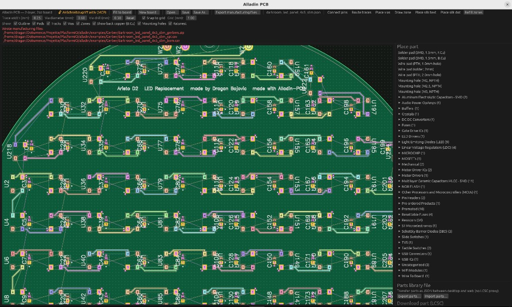

# Alladin PCB

Correct-by-construction PCB editor: real **JLCPCB** design rules enforced
live while you place and route. AI-drivable via **MCP**. Written in Rust.

**License: [AGPL-3.0-only](LICENSE)** — Copyright © 2026 Dragan Bojovic.
See [NOTICE](NOTICE) for third-party credits (Hershey font; optional
external autorouter).

Deutsche Einstiegsanleitung: [ANLEITUNG_FUER_ANFAENGER.md](ANLEITUNG_FUER_ANFAENGER.md).



## Download (precompiled, nothing to build)

Grab the ready-to-run beta from the
**[Releases page](https://github.com/Draganito/alladin-pcb/releases)**:
`alladin-pcb_<version>_amd64.deb` (under *Assets*) is the one release
file — the Alladin binary **plus** a working copy of the external
autorouter with its precompiled Rust core, packaged as a Debian package:

```bash
sudo apt install ./alladin-pcb_<version>_amd64.deb
alladin-pcb
```

The autorouter's Python dependencies install automatically; in the
**Autoroute (extern)** settings just point the tool folder at
`/usr/share/alladin-pcb/KiCadRoutingTools` and set Python to `python3`.
Debian/Ubuntu x86-64, glibc 2.39+. Everything below is only needed if
you want to build from source.

## What you get

- **Own board format** — Alladin `.json` is the source of truth.
- **Native manufacturing export** — one action writes:
  - `<name>_gerbers.zip` (Gerber + drill)
  - `<name>_cpl.csv` (pick & place)
  - `<name>_bom.csv` (LCSC part numbers)
- **No KiCad required** to design or order boards. KiCad 8/9 is optional
  only if you want KiCad's own DRC.
- **Optional autorouter** — [KiCadRoutingTools](https://github.com/drandyhaas/KiCadRoutingTools)
  by Andy Haas (MIT), invoked **unmodified** via `route.py`. That project
  is **not** part of this repository; clone it beside Alladin if you want
  it (see [Autorouter setup](#autorouter-setup-optional) below).
  Convenience binary packages may bundle an unmodified copy to ease
  first-time setup.
- **Silkscreen** — embedded Hershey Futural stroke font; editor preview
  matches Gerber output.

## Build

Requirements: recent Rust (stable), Linux desktop (X11/Wayland), glibc 2.39+.

```bash
cargo build --release -p alladin-pcb
./target/release/alladin-pcb
```

Tests:

```bash
cargo test --workspace
```

## Autorouter setup (optional)

Everything except autorouting works without this. One-time setup:

```bash
# 1. Clone the external tool beside this repo (it is gitignored here)
git clone https://github.com/drandyhaas/KiCadRoutingTools.git

# 2. Python deps in a local venv
cd KiCadRoutingTools
python3 -m venv .venv
./.venv/bin/pip install -r requirements.txt

# 3. Fetch the tool's precompiled Rust router core (no Rust needed;
#    falls back to `cargo` from-source if no prebuilt exists)
./.venv/bin/python3 build_router.py
```

Then in Alladin open the **Autoroute (extern)** settings, set the tool
folder to `KiCadRoutingTools/` and the Python binary to
`KiCadRoutingTools/.venv/bin/python3`, and run the built-in diagnose.
The tool's own [README](https://github.com/drandyhaas/KiCadRoutingTools#readme)
documents everything else, including `build_router.py --from-source`.
The German beginner guide covers the same steps in detail
(ANLEITUNG, section 16).

## AI control (MCP)

```bash
./target/release/alladin-pcb --allow-ai-write
```

Copy the *contents* of [`contrib/cursor-setup/`](contrib/cursor-setup)
(`.cursor/` **and** `.cursorignore`) into the folder you open in Cursor:
`.cursor/mcp.json` points at `http://127.0.0.1:8642/mcp`,
`.cursor/rules/alladin-mcp.mdc` makes the AI act tersely and tool-first,
and `.cursorignore` hides board `.json` files from the AI so the MCP
tools (where Alladin validates every change) are its only way to touch
the board.

## Example board

[`examples/darkroom_led_panel_4x5_slim.json`](examples/darkroom_led_panel_4x5_slim.json)
— open it from the GUI (**Open…**).

## Repository layout

```text
crates/           Rust workspace members
tools/hershey/    Font sources + generator
docs/             Screenshot + short architecture notes
examples/         Example Alladin boards (.json)
contrib/          Optional Cursor MCP config
dist/             Scripts/templates for an optional binary package
ANLEITUNG_….md    German beginner guide
```

See [docs/architecture.md](docs/architecture.md).

## Credits

- Autorouting (optional): [KiCadRoutingTools](https://github.com/drandyhaas/KiCadRoutingTools)
  by **Andy Haas (drandyhaas)**, MIT — used unmodified, not vendored here.
- Silkscreen glyphs: Hershey Futural (Dr. A. V. Hershey / James Hurt) —
  see `tools/hershey/USE_RESTRICTION.txt`.
